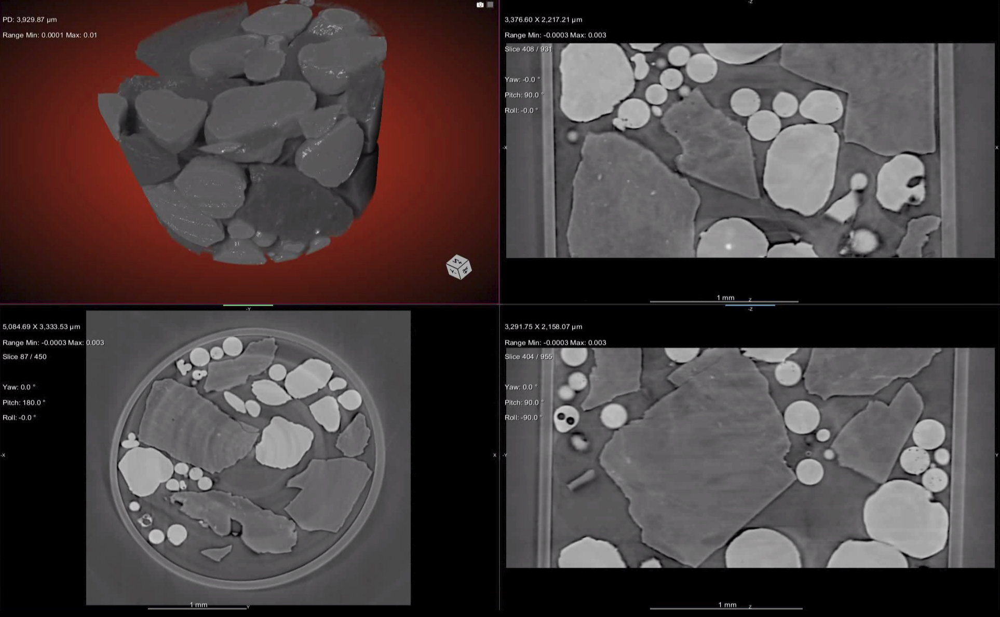

================
LpRec
================
Log-polar based method for tomography reconstruction. For details, see

Andersson, Fredrik, Marcus Carlsson, and Viktor V. Nikitin. "Fast algorithms and efficient GPU implementations for the Radon transform and the back-projection operator represented as convolution operators." SIAM Journal on Imaging Sciences 9.2 (2016): 637-664, (https://epubs.siam.org/doi/10.1137/15M1023762).

The proposed method is based on the fact that the Radon transform and its adjoint, the back-projection operator, can both be expressed as convolutions in log-polar coordinates. Hence, fast algorithms for the application of these operators can be constructed by using the FFT, if data is resampled at log-polar coordinates. In combination with GPU accelearation, the proposed scheme allowed for fastest Filtered Backprojection and Iterative reconstruction procedures.

Reconstruction by LpRec:

================
Installation
================

Install from source::

  python setup.py install

Dependencies::

  cupy, scikit-build

Tests:
  See tests/
  Run ./tests/run_test.py to perform all unit tests

Wrapper in tomopy
==================

See tomopy/tomopy/recon/wrappers.py file for a wrapper to the lprec library. Also see tomopy/doc/demo/lprec.ipynb jupyter notebook for functionality demonstration. The notebook shows examples of reconstruction by FBP, gradient-descent, conjugate gradient, TV, and EM methods.   

FBP and Iterative schemes
==================

lprec/lpmethods.py module contains FBP reconstruciton function and iterative schemes implemented with using the log-polar based method. Iterative schemes are written in python with using cupy module for GPU acceleration of linear algebra operations. Access to gpu data inside the lprec library works via pointers to gpu memory.

================
Developers
================
Viktor Nikitin (vnikitin@anl.gov)
